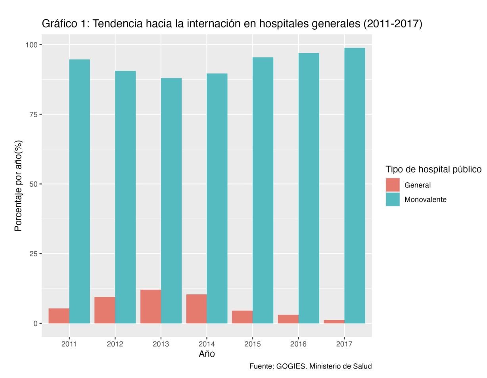

  

<h1 align="center">🧠 Ley Nacional de Salud Mental | Análisis Exploratorio</h1>

<h2>📌 Resumen</h2>

El siguiente trabajo de análisis de datos realiza un acercamiento exploratorio a la evidencia disponible sobre la implementación de la <strong>Ley Nacional de Salud Mental</strong>, a través de la recopilación de datos e información de distintas fuentes.

Esta búsqueda se considera un hecho necesario en el monitoreo de una política pública, sobre todo una que se plantea como un marco general para la adecuación de otras áreas.

Como una de las tres fuentes de información consideradas, se incursionó en el análisis de la información disponible en bases públicas gubernamentales de libre acceso en formato <strong>.csv</strong> y <strong>Excel</strong>.

<h2>🛠️ Skills Técnicas</h2>

<ul>
  <li>Búsqueda, extracción y carga en RStudio de bases de datos en formato <strong>Excel</strong> y <strong>.csv</strong> de acceso público.</li>
  <li>Filtrado de los datos según período temporal y variables pertinentes al análisis.</li>
  <li>Análisis exploratorio de los datos.</li>
  <li>Evaluación de tendencias temporales.</li>
  <li>Utilización de la librería <code>ggplot2</code> para visualización y gráficos.</li>
</ul>

<h2>📌 Resultados</h2>

<ul>
  <li>Redacción de un informe final dirigido a distintos actores relativos a la implementación de políticas públicas en Salud Mental en Argentina.</li>
  <li>Evaluación de la calidad de la información disponible en torno a la implementación de la Ley Nacional de Salud Mental.</li>
  <li>Análisis bibliográfico y revisión del estado del arte en la materia.</li>
</ul>
